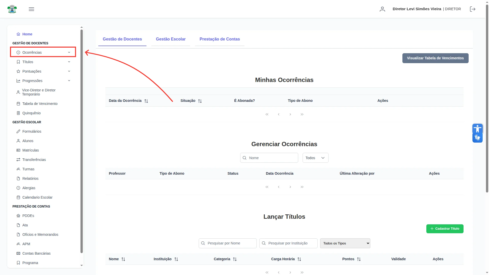

# Gerenciar Ocorrências

O diretor tem acesso para gerenciar as ocorrências dos docentes. Na aba de "Ocorrências":

Possui uma aba chamada "Gerenciar Ocorrências". Clicando nela você entrará na tela de Gerenciar Ocorrências. No canto superior direito existe um 
botão verde chamado "Cadastrar Ocorrência". 

Clicando no botão, irá abrir uma tela para Lançar uma ocorrência para um docente. Agora preencha as informações necessárias.

Primeiro, selecione o docente que irá receber a ocorrência.

Preencha a descrição (não é um campo obrigatório).

Por fim selecione a data daquela ocorrência.

E clique no botão de salvar. 

Caso tudo ocorra corretamente aparecerá uma mensagem de sucesso. 
